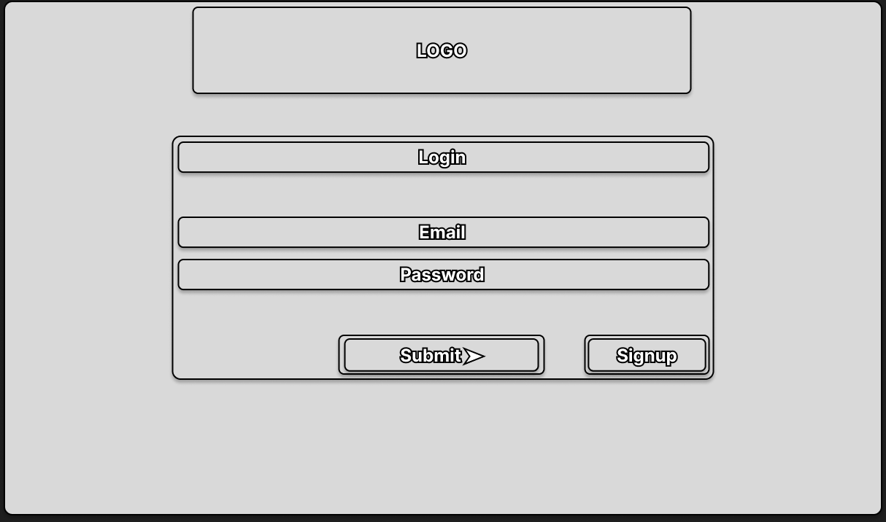
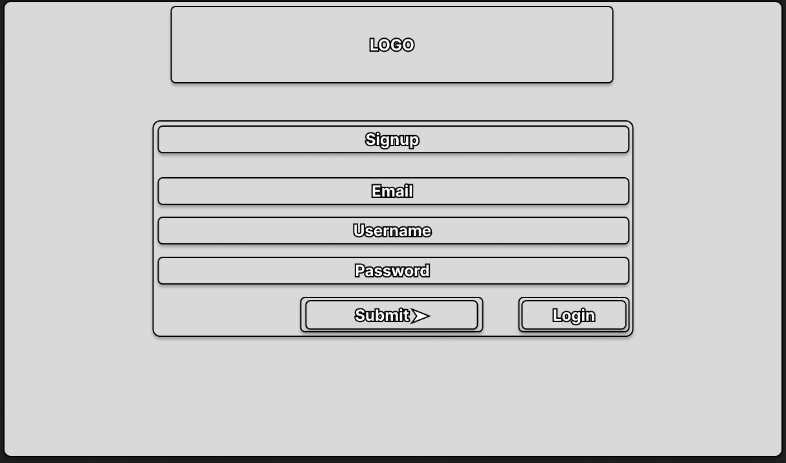
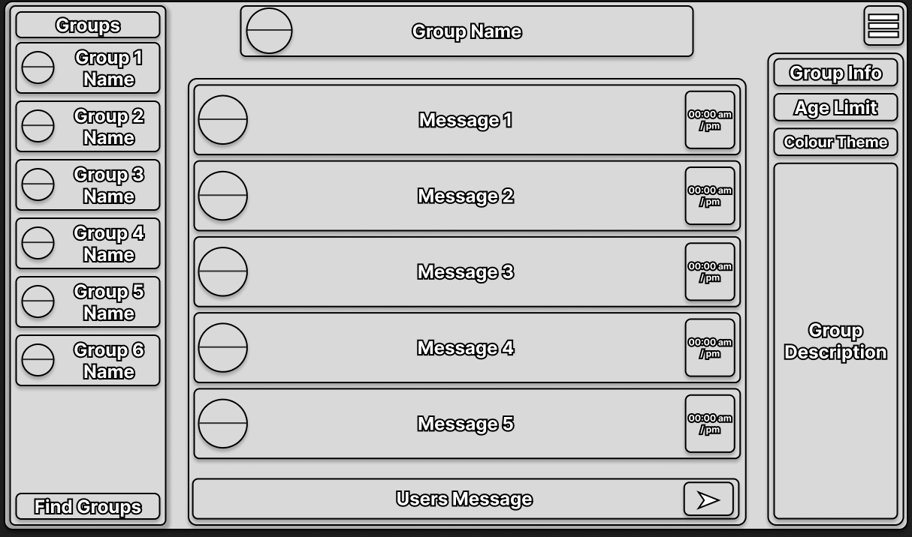
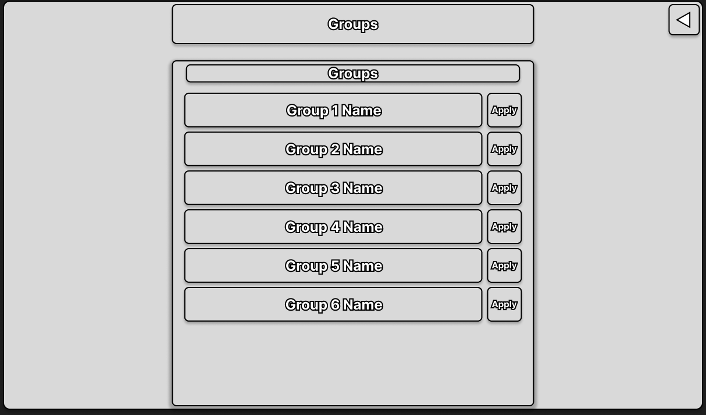
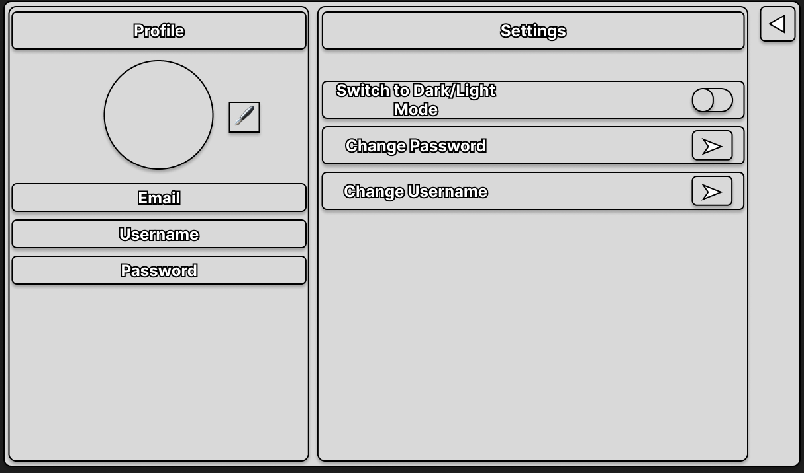
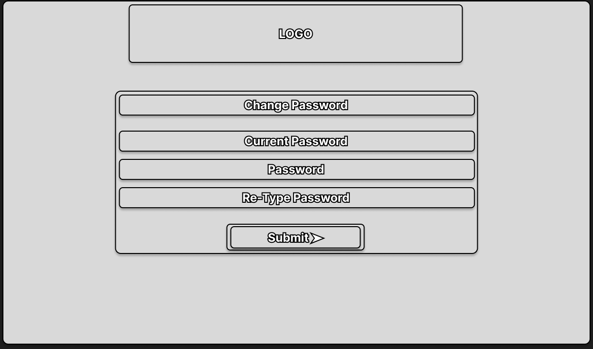
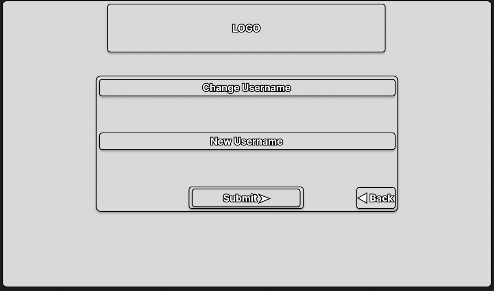

# Lachlan Barnett, s5438449, Thurday 9 - 11

Fabulari is a real-time chat application developed as part of the 3813ICT assignment, built on using systems such as Angular and Node.js powering live communication. Similar to platforms like WhatsApp or Discord, it allows users to exchange text and image messages, while supporting group structures for organising conversations. The application also includes adminstrative functionality, allowing privileged users to manage tasks such as adding new groups, deleting groups, modifying description and names of groups and much more. Development follows a git workflow, with frequent commits to demonstrate the project's progress from initial design through to full implementation.

The branching strategy will follow GitFlow, using "main" and "develop" as the two core branches. The "main" branch will hold the finalised, submission-ready state of the project (including the report and documentation), while "develop" will act as the testing branch for ongoing work and upcoming features.

Commit messages will contain a concise summary of what the commit does, so that the project history can be easily read to understand progress without needing to interpret commit messages. Commits will be kept small and frequent, with each commit representing a single logical change such as adding a feature, fixing a bug, or updating documentation, rather than bundling multiple unrelated changes together.

## Specifications and Assumptions (Functional Requirements)

The below summarises the functional requirements for Fabulari, derived from the client Q&A session, alongside the assumptions made where the specification was unclear, or left to developer choice.

### System / General

| ID | Functional Requirement | Assumption |
|---|---|---|
| 1 | The system shall support real-time delivery of messages between users in the same chat room. | Implemented using a WebSocket-based connection (Node.js) so messages appear live without a page refresh. |
| 2 | Users shall register their own account with an email, password, and profile details. | No OAuth/social sign-up; accounts are created directly through the app, and email doubles as the unique identifier. |
| 3 | Passwords shall be hashed before being stored. | No further password security (e.g. 2FA, password complexity rules) is required beyond hashing, per the client's "no specific cyber security" answer. |
| 4 | Users shall be able to change their password by entering their old password once and their new password twice. | The server verifies the old password against the stored hash and confirms the two new password entries match before updating. |
| 5 | There is no automated password-reset/recovery flow. | If a user forgets their password, they must create a new account, as stated directly by the client. |
| 6 | Users shall be able to toggle the UI between light and dark mode. | Theme preference is a personal display setting, separate from a group's colour theme. |
| 7 | The application shall be usable on desktop/PC as the primary target. | Tablet responsiveness is treated as a bonus/stretch goal; no mobile app or mobile-optimised layout is required. |
| 8 | Users shall be able to attach an image to a message. | Only PNG images are accepted, with a maximum file size of 2MB, per the client's stated limits. |
| 9 | Groups shall not have a profile picture. | Confirmed directly by the client; a group's identity is conveyed through its name, description, and colour theme only. |
| 10 | Links shared in messages shall be displayed as plain text, not clickable hyperlinks. | Reduces exposure to malicious/external links. |
| 11 | Chat rooms only persist the 5 most recent messages once a user leaves and rejoins. | While a user is actively in a room during a session they see the full session history; on rejoining later, only the last 5 stored messages are shown. |

### Users / Members

| ID | Functional Requirement | Assumption |
|---|---|---|
| 12 | Users shall be able to view a list of all existing groups in the system. | Visibility is not restricted by a group's age limit; a user can see a group even if they are too young to join it. |
| 13 | Users shall be able to request to join a group. | If the user does not meet the group's minimum age requirement, the join request is automatically rejected. |
| 14 | Users shall be able to request that a new group be created, supplying the title, description, age limit, and colour theme with the request. | The request is sent to the super admin, who creates the group on the user's behalf; the requester becomes the group's default group admin. |
| 15 | Users shall be able to propose a new chat room within a group they are a member of. | The proposal is reviewed by a group admin, who may approve or reject it; a rejection must include a reason. Once submitted, a request cannot be cancelled. |
| 16 | A group is not required to have any chat rooms. | Confirmed directly by the client; a group may have 0 or unlimited rooms, so the UI must handle an empty room list. |
| 17 | Users shall be able to view their own pending and past-rejected room requests. | Approved requests simply appear as new rooms; there is no separate "approved requests" history to review. |
| 18 | Users shall be able to send text messages and (PNG) image messages within a chat room they belong to. | No voice messages, GIFs, or other file types are supported. |
| 19 | Users shall be able to see who else is currently present in a chat room, and receive a notification when someone joins or leaves. | Presence is scoped to the room the user is actively viewing. |
| 20 | Users shall have a profile page, editable by themselves, including an optional profile photo. | All profile fields are editable except the email address, which is the account's unique identifier. Profiles are private and not viewable by other users. |
| 21 | Messages shall display a timestamp and the sender's profile photo. | The client confirmed no reply/threading feature; editing or deleting a sent message was not explicitly addressed either way, so it is assumed unsupported, consistent with the fixed 5-message history model above. |
| 22 | Users shall be able to leave a group at any time. | Leaving a group does not delete the user's account, only their membership of that group. |

### Group Admin

| ID | Functional Requirement | Assumption |
|---|---|---|
| 23 | A group admin shall be able to edit their group's description, age limit, and colour theme. | Per the client's later clarification, the group's name cannot be changed once created, even by its group admin. |
| 24 | A group's colour theme shall apply to all chat rooms within it. | Confirmed directly by the client; individual chat rooms do not have their own independent theme setting. |
| 25 | There is no limit to the number of groups a single user can be a group admin of. | Confirmed directly by the client; a user may hold the group admin role in multiple groups at once. |
| 26 | A group admin shall be able to approve or reject user-submitted chat room requests, supplying a reason for any rejection. | Chat rooms are only ever created in response to a user request; group admins do not create rooms unprompted. |
| 27 | A group admin shall be able to edit the name/description of an existing chat room. | Allows correction of typos made when the room was first proposed/created. |
| 28 | A group admin shall be able to promote an existing group member to group admin, and demote another group admin (if more than one exists). | A group must always retain at least one group admin, so a sole admin cannot demote themselves without first promoting a replacement. |
| 29 | A group admin shall be able to ban a user from their specific group. | A ban must be based on a user report rather than issued arbitrarily, and an admin cannot approve their own ban request. Group bans are permanent (no un-ban), though the user may create a new account. |
| 30 | A group admin shall be able to request that the super admin permanently delete a user from the entire system. | This system-wide ban/deletion is final and the associated email can never be reused. |
| 31 | A group admin shall be able to request that the super admin delete their group. | A group cannot delete itself outright; deletion always routes through super admin approval. |
| 32 | Group membership shall be automatically revoked for any existing member who falls below a group's age limit after it is raised. | Enforced immediately when the age limit is changed, not just for new join requests. |
| 33 | A group admin shall be able to view the full list of current and banned members for their own group. | Visibility is restricted to that single group; a group admin cannot see a user's membership in other groups. |
| 34 | A visual indicator shall show when a chatting user is a group admin for that group. | Displayed alongside their name/messages in the chat room. |

### Super Admin

| ID | Functional Requirement | Assumption |
|---|---|---|
| 35 | The system shall support exactly one super admin account. | The super admin account cannot be deleted and is seeded/created outside the normal registration flow. |
| 36 | The super admin shall approve or reject user requests to create a new group. | The super admin only actions requests; they do not create groups directly on their own initiative. |
| 37 | The super admin shall approve group-deletion requests submitted by a group admin. | Deletion always originates from the group admin; the super admin cannot unilaterally delete a group. |
| 38 | The super admin shall be able to permanently ban/delete a user from the system, acting on a group admin's request. | If the user being removed is a group admin, a replacement admin must be assigned first so their group is never left without one. |
| 39 | The super admin shall have access to an audit log of system actions (group creation/deletion, bans, deletions, etc.), filterable by type and ordered by date. | Provides accountability/traceability for all privileged actions taken in the system. |
| 40 | The super admin shall not be able to send direct messages to regular users. | The super admin role is administrative only and does not participate in chat. |

## Data Structures

The tables below describe the data structures used to store and represent Fabulari's data, based on the entities implied by the functional requirements above (Users, Groups, Rooms, Messages, and the various request/moderation records). Group membership and admin status are stored as a role on the membership record rather than as a separate field on the user, since a user can be a member of many groups and hold a different role in each.

### User

| Field | Type | Description |
|---|---|---|
| id | string | Unique identifier for the user. |
| email | string | Unique login identifier; cannot be changed after registration. |
| username | string | Display name, editable by the user. |
| passwordHash | string | Hashed password, never stored or transmitted in plain text. |
| dateOfBirth | date | Used to calculate age against a group's age limit. |
| profilePhoto | string | Path/URL to the user's profile image; optional. |
| theme | string | UI display preference, "light" or "dark". |
| isSuperAdmin | boolean | True only for the single super admin account. |
| createdAt | date | Timestamp the account was created. |

### Group

| Field | Type | Description |
|---|---|---|
| id | string | Unique identifier for the group. |
| name | string | Group name, set at creation and immutable afterwards. |
| description | string | Editable description of the group. |
| ageLimit | number | Minimum age required to join the group. |
| colourTheme | string | Colour theme applied to the group and cascaded to its rooms. |
| members | array of Membership | Current members and their role (see Membership below). |
| bannedUserIds | array of string | Users permanently banned from this specific group. |
| createdAt | date | Timestamp the group was created. |

### Group Role

| Field | Type | Description |
|---|---|---|
| userId | string | Reference to the User. |
| role | string | "admin" or "member" within this group. |
| joinedAt | date | Timestamp the user joined the group. |

### Room

| Field | Type | Description |
|---|---|---|
| id | string | Unique identifier for the room/channel. |
| groupId | string | Reference to the parent Group. |
| name | string | Room name; editable by a group admin. |
| description | string | Editable description of the room. |
| createdAt | date | Timestamp the room was created. |

### Message

| Field | Type | Description |
|---|---|---|
| id | string | Unique identifier for the message. |
| roomId | string | Reference to the Room the message was sent in. |
| senderId | string | Reference to the User who sent the message. |
| type | string | "text" or "image". |
| content | string | The message text, or the path/URL of the attached PNG image. |
| timestamp | date | Time the message was sent. |

### Group Request

| Field | Type | Description |
|---|---|---|
| id | string | Unique identifier for the request. |
| requestedBy | string | Reference to the User who submitted the request. |
| title | string | Proposed group name. |
| description | string | Proposed group description. |
| ageLimit | number | Proposed minimum age. |
| colourTheme | string | Proposed colour theme. |
| status | string | "pending", "approved", or "rejected". |
| reviewedBy | string | Reference to the super admin who actioned the request. |
| createdAt | date | Timestamp the request was submitted. |

### Room Request

| Field | Type | Description |
|---|---|---|
| id | string | Unique identifier for the request. |
| groupId | string | Reference to the Group the room is proposed in. |
| requestedBy | string | Reference to the User who submitted the request. |
| name | string | Proposed room name. |
| description | string | Proposed room description. |
| status | string | "pending", "approved", or "rejected". |
| rejectionReason | string | Reason given by the group admin, required if rejected. |
| reviewedBy | string | Reference to the group admin who actioned the request. |
| createdAt | date | Timestamp the request was submitted. |

### Join Request

| Field | Type | Description |
|---|---|---|
| id | string | Unique identifier for the request. |
| groupId | string | Reference to the Group being requested to join. |
| userId | string | Reference to the User requesting to join. |
| status | string | "pending", "approved", or "rejected". |
| reviewedBy | string | Reference to the group admin who actioned the request (or null if auto-rejected for age). |
| createdAt | date | Timestamp the request was submitted. |

### Report

| Field | Type | Description |
|---|---|---|
| id | string | Unique identifier for the report. |
| reportedUserId | string | Reference to the User being reported. |
| reportedBy | string | Reference to the User who filed the report. |
| groupId | string | Reference to the Group the report relates to; null for a system-wide report. |
| reason | string | Explanation provided by the reporting user. |
| status | string | "pending", "actioned", or "dismissed". |
| createdAt | date | Timestamp the report was filed. |

### Ban

| Field | Type | Description |
|---|---|---|
| id | string | Unique identifier for the ban. |
| userId | string | Reference to the banned User. |
| scope | string | "group" (banned from one Group) or "system" (permanently removed from Fabulari). |
| groupId | string | Reference to the Group, if scope is "group". |
| reportId | string | Reference to the Report the ban was actioned from. |
| issuedBy | string | Reference to the admin (group admin or super admin) who issued the ban. |
| createdAt | date | Timestamp the ban was issued. |

### Audit Log Entry

| Field | Type | Description |
|---|---|---|
| id | string | Unique identifier for the log entry. |
| type | string | Action type, e.g. "GROUP_CREATED", "GROUP_DELETED", "USER_BANNED", "ROOM_APPROVED". |
| actorId | string | Reference to the super admin who performed the action. |
| targetId | string | Reference to the entity the action was performed on (user, group, etc.). |
| details | string | Free-text summary of the action, for display in the audit log. |
| timestamp | date | Time the action occurred; the log is filterable by type and ordered by this field. |

## Proposed Angular Architecture

Fabulari's front end will be an Angular application organised into feature folders (auth, chat, groups, settings, admin, shared), with a thin service layer handling all communication with the Node.js backend — either over HTTP for standard CRUD-style requests, or over a WebSocket connection for real-time chat. Route guards restrict access based on login state and a user's role (regular member, group admin of the current group, or super admin), matching the permission structure defined in the functional requirements above.

### Models

TypeScript interfaces mirroring the data structures defined above, used across services and components.

| Model | Mirrors | Purpose |
|---|---|---|
| User | User | Logged-in user's profile and preferences. |
| Group | Group, Group Role | A group, its metadata, and its member list. |
| Room | Room | A chat room/channel within a group. |
| Message | Message | A single chat message. |
| GroupRequest | Group Request | A user's request to create a new group. |
| RoomRequest | Room Request | A user's request to create a new room. |
| JoinRequest | Join Request | A user's request to join a group. |
| Report | Report | A report filed against a user. |
| Ban | Ban | A group-level or system-level ban record. |
| AuditLogEntry | Audit Log Entry | A single entry in the super admin's audit log. |

### Services

| Service | Responsibility |
|---|---|
| AuthService | Login, signup, logout, and holding the current user's session/auth token; exposes the logged-in user to the rest of the app. |
| UserService | Fetching and updating the current user's profile, changing password, changing username, uploading a profile photo. |
| GroupService | Listing all groups, fetching a single group's details, submitting a group creation request, submitting/cancelling a join request, leaving a group. |
| RoomService | Listing rooms for a group, submitting a room creation request, editing room details (group admin). |
| ChatSocketService | Wraps the WebSocket connection; joins/leaves a room, sends/receives messages, and emits presence (user joined/left) and notification events. |
| RequestService | Fetching the current user's pending and past-rejected group/room requests. |
| ReportService | Filing a report against a user, and listing reports (used by group admin/super admin views). |
| GroupAdminService | Actions scoped to a group admin: approve/reject room and join requests, promote/demote members, ban a member, edit group metadata. |
| SuperAdminService | Actions scoped to the super admin: approve/reject group requests, approve group deletion, ban/delete a user system-wide, fetch the audit log. |
| ThemeService | Reading and persisting the user's light/dark mode preference, applying it at the app root. |

### Components

| Component | Feature Area | Purpose |
|---|---|---|
| Login | auth | Built. Email/password login form; posts directly to the auth API (no AuthService yet). |
| Signup | auth | Built. Registration form (email, username, date of birth, password); posts directly to the signup API. |
| Chat | chat | Built as a single component covering the whole page: renders the group list, room list, message panel, and group info panel inline, rather than being split into separate GroupList/RoomList/MessagePanel/GroupInfoPanel sub-components as originally proposed. Also hosts the Logout button and the settings link directly, since no NavbarComponent exists yet. |
| RoomMembersComponent | chat | Not yet built — shows users currently present in the selected room, per the outstanding note in `Images/info.txt`. |
| Groups | groups | Built (originally proposed as BrowseGroupsComponent). Lists all groups in the system with an Apply/Applied action. |
| GroupRequestFormComponent | groups | Not yet built — modal/dialog for a user to submit a new group request (title, description, age limit, colour theme). |
| RoomRequestFormComponent | groups | Not yet built — modal/dialog for a user to propose a new room within a group. |
| PendingRequestsComponent | groups | Not yet built — lists the current user's pending and past-rejected group/room requests. |
| Report | settings | Built (originally proposed as ReportUserComponent under "shared"). Implemented as its own routed page at `/report`, reachable from Settings' "Submit Report" row, rather than a modal/dialog. |
| Settings | settings | Built. Currently renders the profile panel and the settings panel directly in one template; no separate ProfilePanelComponent has been split out yet. |
| ChangePassword | settings | Built. Old password + new password (x2) form. |
| ChangeUsername | settings | Built. New username form. |
| ChangeBirthdate | settings | Built. New date-of-birth form, reachable from Settings' "Change Birthdate" row — not part of the original proposal. |
| GroupAdminDashboardComponent | admin | Not yet built — group admin's management view: pending room/join requests, member list, promote/demote, ban. |
| SuperAdminDashboardComponent | admin | Not yet built — super admin's management view: pending group requests, group deletion requests, user ban/delete, audit log. |
| AuditLogComponent | admin | Not yet built — filterable, date-ordered table of audit log entries (nested under the super admin dashboard). |
| NavbarComponent | shared | Not yet built — nav elements (Logout, the settings link, back arrows) currently live directly in each page's own template instead of a shared navbar. |
| ConfirmDialogComponent | shared | Not yet built — reusable confirmation modal for destructive actions (e.g. leaving a group, banning a user). |

### Routes

| Path | Component | Guard | Notes |
|---|---|---|---|
| / | Login | guestGuard* | Redirects to /chat if already logged in. |
| /signup | Signup | guestGuard* | Redirects to /chat if already logged in. |
| /chat | Chat | authGuard* | Default landing page after login. |
| /chat/:groupId/:roomId | Chat | authGuard* | Not yet implemented — the current /chat route takes no params. |
| /groups | Groups | authGuard* | Browse/request to join a group. |
| /requests | PendingRequestsComponent | authGuard* | Not yet implemented — the current user's pending/rejected requests. |
| /settings | Settings | authGuard* | Profile and account settings. |
| /change-password | ChangePassword | authGuard* | Top-level route, not nested under /settings as originally proposed. |
| /change-username | ChangeUsername | authGuard* | Top-level route, not nested under /settings as originally proposed. |
| /change-birthdate | ChangeBirthdate | authGuard* | New route, not part of the original proposal. |
| /report | Report | authGuard* | Currently a dedicated routed page rather than the modal originally proposed. |
| /admin/group/:groupId | GroupAdminDashboardComponent | groupAdminGuard* | Not yet implemented — only accessible to that group's admin(s). |
| /admin/super | SuperAdminDashboardComponent | superAdminGuard* | Not yet implemented — only accessible to the single super admin account. |
| ** (wildcard) | — | — | Not yet implemented. |

\* No route guards are wired up in the current code yet — every route above is currently open to direct navigation regardless of login state.

## Proposed Server Endpoints

The tables below list the REST endpoints Fabulari's Node.js backend is expected to expose, grouped by resource and mapped to the data structures and functional requirements defined above. Real-time messaging and presence run over a WebSocket connection rather than REST, listed separately at the end.

### Auth

| Method | Endpoint | Description | Access |
|---|---|---|---|
| POST | /api/auth/signup | Register a new user account. | Public |
| POST | /api/auth/login | Authenticate and start a session. | Public |
| POST | /api/auth/logout | End the current session. | Logged-in user |

### Users

| Method | Endpoint | Description | Access |
|---|---|---|---|
| GET | /api/users/me | Fetch the current user's profile. | Logged-in user |
| PUT | /api/users/me | Update username and/or profile photo. | Logged-in user |
| PUT | /api/users/me/password | Change password (old password + new password twice). | Logged-in user |
| PUT | /api/users/me/theme | Update light/dark mode preference. | Logged-in user |

### Groups

| Method | Endpoint | Description | Access |
|---|---|---|---|
| GET | /api/groups | List all groups in the system. | Logged-in user |
| GET | /api/groups/:groupId | Fetch a single group's details, including its members. | Logged-in user |
| PUT | /api/groups/:groupId | Edit a group's description, age limit, or colour theme. | Group admin |
| POST | /api/groups/:groupId/join-requests | Request to join a group (auto-rejected server-side if under the age limit). | Logged-in user |
| DELETE | /api/groups/:groupId/membership | Leave a group. | Group member |
| POST | /api/groups/:groupId/delete-requests | Request that the super admin delete the group. | Group admin |
| GET | /api/groups/:groupId/members | List current and banned members of the group. | Group admin |
| PUT | /api/groups/:groupId/members/:userId/role | Promote or demote a member's admin status. | Group admin |
| POST | /api/groups/:groupId/members/:userId/ban | Ban a member from the group (requires an associated report). | Group admin |

### Rooms

| Method | Endpoint | Description | Access |
|---|---|---|---|
| GET | /api/groups/:groupId/rooms | List rooms within a group. | Group member |
| PUT | /api/groups/:groupId/rooms/:roomId | Edit a room's name or description. | Group admin |
| POST | /api/groups/:groupId/room-requests | Propose a new room within the group. | Group member |
| GET | /api/groups/:groupId/room-requests | List pending room requests for the group. | Group admin |
| PUT | /api/groups/:groupId/room-requests/:requestId | Approve or reject a room request (rejection requires a reason). | Group admin |

### Messages

| Method | Endpoint | Description | Access |
|---|---|---|---|
| GET | /api/rooms/:roomId/messages | Fetch the last 5 stored messages for a room (shown when a user (re)joins). | Room member |

### Requests

| Method | Endpoint | Description | Access |
|---|---|---|---|
| POST | /api/group-requests | Submit a request to create a new group (title, description, age limit, colour theme). | Logged-in user |
| GET | /api/group-requests/mine | List the current user's pending/rejected group requests. | Logged-in user |
| GET | /api/room-requests/mine | List the current user's pending/rejected room requests. | Logged-in user |

### Reports

| Method | Endpoint | Description | Access |
|---|---|---|---|
| POST | /api/reports | File a report against another user, with a reason. | Logged-in user |
| GET | /api/groups/:groupId/reports | List reports filed within a group. | Group admin |

### Super Admin

| Method | Endpoint | Description | Access |
|---|---|---|---|
| GET | /api/admin/group-requests | List pending group creation requests. | Super admin |
| PUT | /api/admin/group-requests/:requestId | Approve (creates the group) or reject a group request. | Super admin |
| GET | /api/admin/group-delete-requests | List pending group deletion requests. | Super admin |
| PUT | /api/admin/group-delete-requests/:requestId | Approve or reject a group deletion request. | Super admin |
| POST | /api/admin/users/:userId/ban | Permanently ban/delete a user from the system. | Super admin |
| GET | /api/admin/users | List all users, including system-banned accounts. | Super admin |
| GET | /api/admin/audit-log | Fetch the audit log, filterable by type and ordered by date. | Super admin |

### WebSocket Events

| Event | Direction | Description |
|---|---|---|
| room:join | Client → Server | Join a room to receive its live messages and presence updates. |
| room:leave | Client → Server | Leave a room. |
| message:send | Client → Server | Send a text or image message to the currently joined room. |
| message:new | Server → Client | Broadcast a new message to everyone in the room. |
| presence:update | Server → Client | Current list of users present in the room. |
| presence:joined | Server → Client | Notify the room that a user has joined. |
| presence:left | Server → Client | Notify the room that a user has left. |
| notification | Server → Client | Push a notification to a user (e.g. their request was approved/rejected). |

 

## Design Documents (Wireframes)

### 1. Login

This is the login page of the app, this is where the user enters their email and password and presses Submit to authenticate; the Signup button routes a new user across to the registration page instead. This satisfies the requirement for basic username/password authentication, and is the gate that every other functional requirement sits behind.

### 2. Signup

This is the signup page, this is where a new user creates their account by entering their email, username, date of birth, and password (FR-2). The date of birth is asked for here so it can be checked against a group's age limit later on (FR-13). The password gets hashed on the server before it's stored (FR-3), which you can't really see in the wireframe but is what happens once Submit is pressed. The Login button just sends an existing user back to the login page instead.

### 3. Chat

This is the chat page, this is where the user spends most of their time once they're logged in. On the left is the list of groups the user is in, with a Find Groups button at the bottom that takes them to the Groups page (FR-12). Next to that is the list of rooms inside whichever group is selected (FR-16). The middle panel shows the messages in the selected room, each with a timestamp and the sender's photo (FR-11, FR-21), plus a box at the bottom to type and send a new message (FR-1, FR-18). On the right, a group admin can view and edit the group's description, age limit and colour theme (FR-23, FR-24). In the current build, the hamburger icon in the top-right corner links to Settings rather than acting as a sidebar toggle; the groups/rooms column and the group-info column are instead shown or hidden independently via two dedicated arrow buttons, and a Logout button sits in the top-left corner. This page still needs the room member list (FR-19) and an admin badge on messages (FR-34) added, as noted in Images/info.txt.

### 4. Groups

This is the groups page, this is where the user can see every group that exists in the system (FR-12). Each group has an Apply button next to it so the user can request to join (FR-13), and the request gets rejected automatically if they don't meet the group's age limit. The back arrow in the corner just takes them back to the chat page.

### 5. Settings

This is the settings page, this is where the user manages their account. It's split into a Profile panel on the left showing their photo, email, username and date of birth (FR-20), and a Settings panel on the right with the actual controls. The Dark/Light Mode switch is FR-6. Change Password, Change Username, and Change Birthdate (added since this wireframe was drawn) each open their own separate page rather than being editable right there, and Submit Report is where a user reports someone else, which is the step a group admin needs before they can ban that person.

### 6. Change Password

This is the change password page, this is where FR-4 happens: the user types their current password once, then their new password twice, and the server checks the current password is correct and that the two new entries match before it updates anything. The Back button just returns to settings without saving.

### 7. Change Username

This is the change username page, this is where the user updates their username, one of the profile fields the client confirmed can be changed (FR-20). It's kept as its own page rather than an inline edit, the same way Change Password is.

### Responsiveness

Desktop is the primary target and tablet is a bonus, per FR-7. The layout most affected by a smaller viewport is Chat, since it is the only page built from side-by-side columns. In the current build, the groups/rooms column and the group-info column are shown or hidden via two dedicated toggle buttons that work at any viewport width, rather than being tied to a breakpoint; below a 900px-wide viewport a media query narrows those columns and shortens the message list / info panel instead of hiding them outright. The Settings page's two panels (Profile and Settings) do not yet stack vertically on narrow viewports — that responsive behaviour from the original proposal has not been implemented. Login, Signup, Groups, Change Password, Change Username, and Change Birthdate are single-column layouts, so they don't need to adapt further beyond their max-width shrinking to fit the viewport.